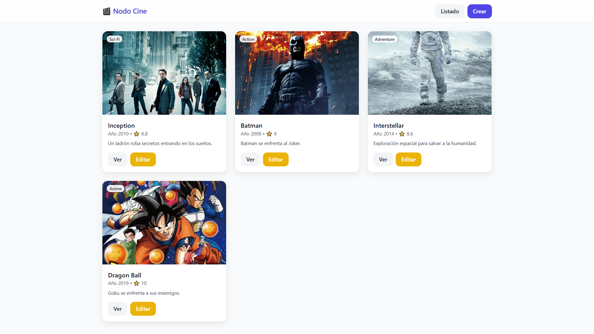

# 🎬 Nodo Cine — TP-5 React

App de CRUD de películas hecha con **React + Vite** y **Tailwind CSS**, usando **MockAPI** como backend. Permite **listar, crear, editar y eliminar** películas.

## 🚀 Demo
**Netlify:** https://fantastic-kitten-bf527f.netlify.app/items

## ✨ Funcionalidades
- Listado de películas (GET /movies)
- Detalle de película (GET /movies/:id)
- Crear (POST /movies)
- Editar (PUT /movies/:id)
- Eliminar con confirmación (DELETE /movies/:id)
- Estado global con **Context + Reducer**
- Notificaciones con **React Toastify**
- Estilos modernos con **Tailwind** (plugins de forms/typography/line-clamp opcionales)

## 🧱 Tech
React, Vite, React Router DOM, Axios, Tailwind CSS, React Toastify, MockAPI.

## 📦 Instalación
```bash
git clone https://github.com/Emanuel-Isaias-M/Tp-5-React.git
cd Tp-5-React
npm install
```

### Variables de entorno
Crear `.env` en la raíz:
```
VITE_API_BASE=https://68997345fed141b96b9f876a.mockapi.io/api/v1
```
> Ajustar si cambia la base en MockAPI (no incluir `/movies` al final).

### Correr en dev
```bash
npm run dev
```

### Build de producción
```bash
npm run build
```
El build queda en `dist/`. Para deploy manual en Netlify, subir **la carpeta `dist/`**.

## 🗂️ Estructura
```
src/
  api/axios.js           # instancia de Axios
  context/MoviesContext.jsx
  router/AppRouter.jsx
  components/
    MovieCard.jsx
    MovieForm.jsx
  pages/
    MovieList.jsx
    MovieDetail.jsx
    MovieCreate.jsx
    MovieEdit.jsx
    NotFound.jsx
  App.jsx
  main.jsx
  index.css
```

## 🧭 Rutas
- `/items` — listado
- `/items/create` — crear
- `/items/:id` — detalle
- `/items/:id/edit` — editar
- `*` — 404

## 🖼️ Captura



## 📄 Licencia
Proyecto realizado por Isaias Morales (TP-5 React).
